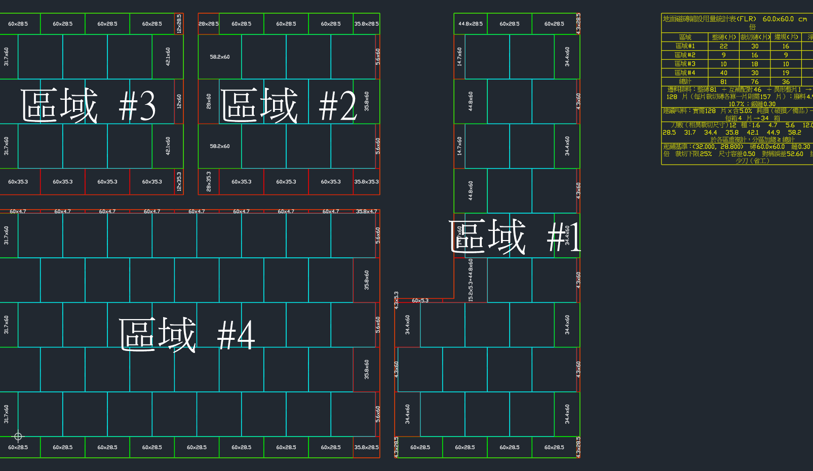
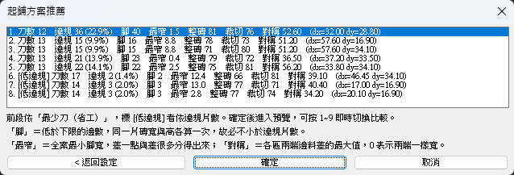
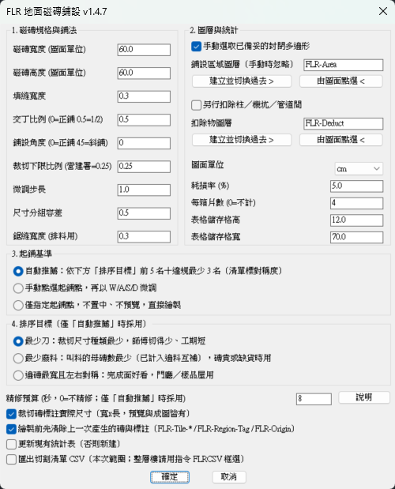
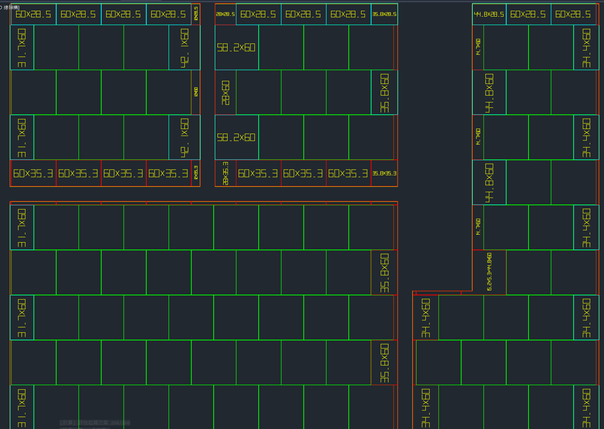
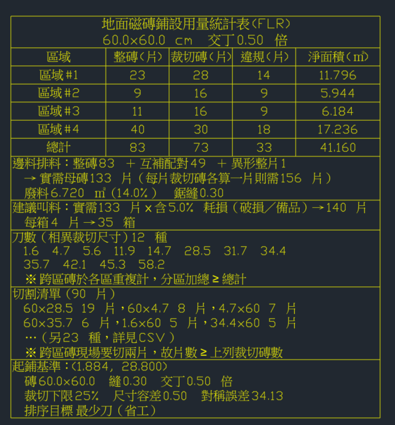

# FLR — AutoCAD 地面磁磚鋪設規劃

[](https://github.com/SodaCK87/autocad-floortile-showcase/actions/workflows/ci.yml)

> **產出方式：本專案是與 Anthropic 的 Claude（Claude Code）協作開發的。**
> 需求界定、技術取捨與驗收由我把關，Claude 參與實作、測試撰寫與文件整理。
> README 裡的每一組數字都來自實機量測，不是估算——包括那些**推翻我自己判斷**的量測結果
> （見〈先量再改〉與〈我推翻過自己三次〉兩節）。

把「這層樓的磁磚要從哪裡開始鋪」從師傅的經驗，變成圖面上算得出來、挑得到的方案。

在 AutoCAD 裡輸入 `FLR`、框選房間，它把上千種起鋪位置各評估一次，依你選的目標
（**最少刀**／**最少廢料**／**邊磚最寬且左右對稱**）列出前幾名；選一個進即時預覽，
`W`/`A`/`S`/`D` 微調、數字鍵換方案，確定後把磚、裁切尺寸標註、用量統計表與切割清單 CSV
一次畫進圖裡。



---

## 這個 repo 是什麼

**這是展示用的節錄，不是完整的外掛。** 完整專案有 12,532 行（不計空白行），
其中 UI、即時預覽與繪圖那半需要 AutoCAD 才跑得起來。

這裡挑出**幾何與最佳化核心**——它完全不呼叫 AutoCAD API（沒有 `entmake`、`ssget`、
`vla-*`、`setvar`，只有 `princ` 印訊息），所以整份邏輯進得了無頭斷言——加上它自己的測試，
以及開發過程中幾個值得講的決策與量測。

| 檔案 | 行數 | 在做什麼 |
| --- | ---: | --- |
| [`src/FLR_Core.lsp`](src/FLR_Core.lsp) | 2,106 | 幾何與最佳化核心：多邊形裁剪、面積、形狀判定、條帶量測、尺寸分群、網格與交丁、候選集與排序、一維排料 |
| [`tests/FLR_Tests.lsp`](tests/FLR_Tests.lsp) | 1,917 | 上面那一份的 596 條斷言 |
| [`tools/FLR_NestLP.py`](tools/FLR_NestLP.py) | 120 | 排料最佳性檢查：Gilmore-Gomory 欄生成算 LP 下界，跟核心的 FFD 比（見決策 3 的尾段） |

```powershell
.\tests\Run-CoreTests.ps1
```

→ **PASS 596 / FAIL 0**（2026-08-17 於 AutoCAD 2027 實跑）。需要本機有 AutoCAD，
但**不必開它的視窗**——執行器走 `accoreconsole.exe`（無視窗核心）。

同一份核心在完整專案裡跑出來的也是 596，一條不多一條不少：載不載入 UI 那一份不影響它。
完整專案另有 UI 層可無頭驗證的 458 條與 GUI 全自動實測 53 項，合計 1,054 條斷言。

> **這裡的 CI badge 不是「測試通過」。** 那 596 條要 `accoreconsole`，GitHub 的 runner 上沒有；
> 拿別的 Lisp 直譯器代跑會得到**隔一層的證據**——語意只要差一點，綠燈就是假的。
> 所以 CI 只做在 runner 上真的驗得到的三件：`.lsp` 是 UTF-8 **無 BOM**（有 BOM 時
> AutoCAD 的 `load` 會把它當成第一個字元，症狀是「載入失敗」而完全指不到編碼）、
> 括號平衡（漏一個 `)` 會安靜地少定義最後幾支函式）、沒有控制字元。
> 檢查器自己也被反向驗過：故意加一行不閉合的 `defun` 進去，它要抓得到才算數。

**不在這裡的**：DCL 對話框、`grread` 即時預覽、`entmake` 繪圖與 AutoCAD 表格物件、
安裝 bundle、GUI 自動化測試工具，以及 33 頁的操作說明書與它的產生器——都要 AutoCAD。

**註解裡的內部參照一併留著**（`FLR:Evaluate`、`FLR:StatsOf`、TAD-01／FLR-14 這些缺陷編號、
CHANGELOG 的版本節……），它們指向完整專案，在這個節錄裡查不到。
刻意不改寫成通用說法：那些註解記的是**當時為什麼那樣決定**，把出處拿掉就只剩結論了。

---

## 專案規模

| | |
| --- | --- |
| 語言與宿主 | AutoLISP，AutoCAD 2027（相容至舊版；圖面單位跟著現場走，現為 cm） |
| 版本 | v1.4.7，核心 `FLR_Core` 0.9 |
| 主程式 | `.lsp` 10 檔 8,462 行（不計空白），另 PowerShell 15 檔 2,766 行、Python 2 檔 1,304 行 |
| 測試 | 無頭斷言 1,054 條（核心 596 ＋ UI 458），另 GUI 全自動實測 53 項 |
| 量測工具 | 六支探針：成本剖析、規模量測、前篩準度校準、排料最佳性、編碼、CSV 的 Excel COM 驗收 |
| 交付 | 雙擊 `install.bat` 裝成 ApplicationPlugins bundle，不必 `APPLOAD`；33 頁操作說明書 |

> git 歷史只回溯到 2026-08-13——這個 repo 是從牆磚版分支出來後重開的，
> 前期的提交不在裡面。所以這裡不列 commit 數；逐版做了什麼在完整專案的 `CHANGELOG.md`。

---

## 五個值得講的決策

### 1. 不做 Region 布林，改成解析式裁剪

上一代（牆磚版）對每一片裁切磚做一次 ActiveX Region 布林運算。地磚版整段換掉，
改成純 LISP 的 Sutherland-Hodgman 多邊形裁剪。

| 項目 | 實測（accoreconsole，AutoCAD 2027） |
| --- | --- |
| 每片裁剪 | **0.055 ms**（289 片 / 16 ms） |
| 面積正確性 | 理論 83.17 ㎡ vs 實測 83.21 ㎡ |
| 三區 140 片單次評估 | 15 ms |
| 三區起鋪點最佳化（含排序） | 219 ms |

外推整層 5,500 片約 300 ms——**所以不需要外部計算引擎**（原本評估過掛一層 Go 服務）。

換掉它連帶根除了上一代的一類缺陷：Region 分解重組失敗時，**統計已經算完、圖卻沒畫出來**。
現在繪圖與統計是兩條獨立的路徑，而且有一組斷言鎖住「即時預覽的數字 ≡ 統計表 ≡
畫出來的碎片面積和」，從結構上封死那類不一致。

還有一個看起來反直覺、但正是解析式做法給的好處：**逐區域各裁一次，而不是先聯集**。
Sutherland-Hodgman 產不出分離片（會產出零寬度的橋接邊）。但被牆分開的三塊區域本來就是
獨立多邊形，`磚∩A` 與 `磚∩B` **天然就是那兩片分離片**——不必做多邊形布林，
「一片磚被牆切成兩塊、兩塊各自要 ≥ 下限」這條規則就支援得了。

### 2. 讓使用者選一個目標，不做加權總分

省工（少切幾種尺寸）、省料（少叫幾箱磚）、好看（邊磚寬且左右對稱）不會同時最好。



一開始想做加權總分。沒做，理由是**三個量綱不同**：刀數是種類數、廢料是片數、對稱是長度，
任何權重都是憑空定的，而且在對話框裡講不清楚。改成三個明確的目標讓使用者選一個，
他知道自己選了什麼；同一張圖換個目標，整份清單就換掉。

同一張平面圖、同一組磚參數，只有目標不同：

| | 最少刀（預設） | 最少廢料 |
| --- | --- | --- |
| 刀數（相異裁切尺寸種類） | 12 | 17 |
| 母磚（叫料量） | 沒算 | 123 |
| 違規 | 36（22.9%） | 17（12.7%） |
| 對稱誤差 | 52.60 | 56.50 |

「母磚」欄只在選了「最少廢料」時才出現——**沒算就是沒算**，硬填一個 0 會被讀成「不用叫料」。

初版把「違規片數」設成所有目標共用的硬性第一順位。**實測直接打臉**：那張圖各方案的違規落差
很大（25～93 片），違規一放前面就完全壓過對稱，「對稱」目標挑出來的方案對稱誤差 **22.5，
比預設的「最少刀」目標還差（20.8）**。使用者選了對稱卻拿到更不對稱的結果，那這個選項等於是壞的。
現在一律「使用者選的那個量排第一」，違規則沿用預設目標的位置，並且清單每列都印出片數與百分比。

### 3. 先量再改：每組候選 −59%，而事前的兩個猜測都是錯的

最佳化要跑「候選 x × 候選 y」組，每組做一次完整佈置與統計，所以成本幾乎全在這裡。
每一次加速都是先用探針把每組成本拆開、再決定動哪一段。

第一刀來自一個現成的事實：那張圖 882 格裡有 **614 格是整磚（69.6%）**，
而整磚的量測結果是**已知常數**（沒有裁切尺寸、沒有違規邊、最窄＝磚的短邊、排料吃一整片）。
原本照樣跑完整套條帶分解，純粹因為「是不是整磚」算在量測迴圈**之後**。把它提到迴圈之前即可跳過，
**不需要任何新的幾何判定**。

| | 每組候選 | 全算 702 組 | 25 秒預算精算得了的組數 |
| --- | ---: | ---: | ---: |
| 改動前 | 302 ms | 212 秒 | 79 |
| 改動後 | **125 ms** | **79.6 秒** | **227** |

第二塊是「整磚連裁剪都不必做」，但這一塊需要一個「這格完全落在區域內部」的快速判定，
而**判定本身的成本會不會吃掉節省，只有量了才知道**。初版順序寫反了，實測直接**變慢**
（182 → 224 ms）：先掃所有區域的矩形分解、再回頭做 bbox，等於把原本就有的那一輪重跑一次。
改成 bbox 先篩、只對真的打中的那一區做包含測試之後才是 125 ms。

把每組成本拆到六段之後，**事前的兩個猜測都是錯的**：

| 段 | 耗時 | 佔每組 |
| --- | ---: | ---: |
| 判定＋裁剪（314 格真的要裁） | 36.3 ms | **54%** |
| 量測（非整磚） | 26.3 ms | **39%** |
| 累加迴圈 | 5 ms | 7% |
| **碎片組裝＋建 alist**（原本懷疑是熱點） | **0 ms** | **0%** |
| **尺寸去重＋分群**（原本懷疑是熱點） | **0 ms** | **0%** |
| 前篩（整場只跑一次） | 213.7 ms | ＝ **3.2 組候選** |

已命名的段相加 67.7 ms ＝ 實測每組 67.7 ms，帳對得起來。結論是**每組成本這條線可以收了**：
93% 是真正的幾何工作。而前篩整場只等於三組候選的成本——加速它沒有意義，
但**要往裡面加更準的估計式，成本上完全付得起**。

這一節有三個方法論上的收穫，每一個都是踩到才學到的：

- **拆解型的探針要自己印出「已命名合計 vs 實測」的差額。** 沒有這一行的時候，
  三段相加與實測的差額一直沒有名字，於是「剩下的花在哪」每次都從猜開始——補完之後那個差額是 **24.6%**。
- **每加一段就要先問「它跟已有的段是並列還是巢狀」。** 第一版把「格內判定」從「判定＋裁剪」
  裡減掉，算出 **−5.7 ms**。負的成本不存在——前者是後者的子集，被重複扣掉了。
- **絕對值不可跨機比較。** 同一份程式跨機差 2.2 倍，同一台不同 run 之間也差近一倍。
  所以探針保留一份舊版原文當對照組，新舊兩條路徑在**同一次 run 內**各量一次；
  要比效能就看那一行，不要拿文件裡的歷史數字相減。

順帶一提，一維排料那一段量完之後是**沒得再省**：`FLR:Pack` 只是 FFD 啟發式，
所以用 [`tools/FLR_NestLP.py`](tools/FLR_NestLP.py) 做 Gilmore-Gomory 延遲行生成算 LP 下界，
六個實例 **FFD 全部等於下界**（`ceil(LP) ≤ OPT ≤ FFD`，相等即證明最佳）。換算法收益 0 片。
真正的槓桿在起鋪點：同一張圖換起鋪點，母磚數在 804～831 之間跑（3.4%）。

### 4. 我推翻過自己三次

這三件的共通點：推論本身講得通，而實測給了相反的答案。

**（一）「圖變大所以推薦會變不準」——錯了，決定準度的是形狀。**

前篩是一維估計式，用來從上千組候選裡挑出要精算的那幾十組。造一組只變一個維度的合成平面圖
之後，先垮的是**預算覆蓋率**：從 56% 掉到 4%（49 間房那種規模，全算要 11 分鐘）。
我據此推論「前篩的準度在這個規模才變成主角」。

跑完 11 分鐘的全算取真值，推論被推翻——**4% 覆蓋率的那張大圖上，前篩反而拿到真值第 1 名**
（那張中等的圖上它只排第 32）。原因不是規模而是**軸間耦合**：前篩假設「x 向只由 `ox` 決定」，
而這個假設會被**凹形**破壞。中等那張有 L 形走道 → 耦合強 → 前篩不準；
49 間房是 49 個矩形 → 幾乎可分離 → 前篩幾乎精確。

**判斷「這張圖的推薦可不可信」，該看的是有沒有凹形／不規則邊界，不是圖多大。**

**（二）「給越多時間不會更差」——量出來不成立，改成由建構保證。**

候選集本身有漏（它的斷點模型只涵蓋刀數的斷點），所以對第 1 名沿兩軸再細掃一遍，
點數由時間預算決定。然後發現：**預算 4 秒的對稱誤差比 8 秒好、16 秒的廢料違規比 32 秒好**。
不是雜訊——這段是確定性的。取樣點是「磚距 ÷ 點數」，31 點與 63 點的格點除了 0 以外毫無交集，
**加預算等於換一組取樣點，而不是加密**。

改成階層式（層 0 是 8 等分，每層補中點）之後「取前 n 個必然包含前 m 個」，
單調性**由建構保證**而不是靠量到剛好單調。**成本完全相同**，而同樣 8 秒預算下對稱的收益
從 0.96% 變成 **2.38%**。

**（三）探針的起點不是成品的起點，收益虛報了十倍。**

量細掃的收益時，我從「前篩自己的第 1 名」出發，讀到廢料違規 95 → 58（**−38.9%**），
漂亮得可疑。但成品走的不是那條路——前篩只挑出 shortlist，之後那幾百組**還會被逐一精算再排名次**，
細掃拿到的是精算後的第 1 名（違規 55 不是 95）。等於把「精算本來就會做的事」算成細掃的功勞。
改成直接呼叫成品的最佳化函式取起點之後，收益從 −38.9% 掉到 **−3.6%**。

順帶一個同類的：校準輸出曾印出「804 vs 804：細掃更好」——同分卻判定更好，看起來像判定壞了。
實際上勝負分在**違規**那一鍵（49 vs 64），是**輸出漏講了，不是判定錯了**。
現在多鍵比較一律連「贏在哪一鍵、兩邊各是多少」一起印。只印招牌數字會定期生出這種假 bug。

### 5. 沒有測試環境，就自己造一個

AutoLISP 沒有現成的測試框架，而 AutoCAD 的 UI 更是沒有。做法分三層：

1. **第一順位是把邏輯抽離宿主 API。** 這個 repo 裡的 `FLR_Core.lsp` 就是這樣來的——
   它只用 AutoLISP 的核心函式，所以 596 條斷言在 `accoreconsole` 裡全自動跑得完。
2. **UI 層裡「其實不需要視窗」的部分也抽出來驗**：單位換算、扣除物化簡、顏色歸屬、
   即時統計行的格式、DCL 產生（含互斥容器檢查）、圖層的建立與切換（13 個不合法字元、
   凍結／鎖定／關閉三態）。這一層另外 458 條。
   其中一組專門守「填回欄位」與「讀出欄位」共用同一份對照表並雙向比對 DCL——
   對話框會因為「點選圖層」而關閉再重開，欄位對不上時設定會被**靜默清掉且不報錯**。
3. **真的要 GUI 的，全自動跑，判定走數值。** 53 項，一次 PowerShell 呼叫走完
   對話框 → 選取 → 最佳化 → 預覽微調 → 繪圖 → 統計表。四條管道：COM 建圖面與驗收、
   `keybd_event` 驅動 `grread`、抓螢幕看暫時圖形、像素差判定按鍵有沒有生效。

第三層不是為了快，是因為**肉眼給不出那個數字**：

> **FLR-14——534 條斷言全綠，而即時預覽的按鍵一個都不會動。**
> 測試自己捏了一個點對 `(cons 2 87)` 餵給按鍵處理函式，而真實的 `grread` 回的是**串列** `(2 87)`。
> 同一段程式在測試裡走一條路、在真機走另一條。抓到它的是像素差：按兩次 `W` 之後畫面
> **0.00%** 改變、修好後 `w`↔`s` 往返又 **0.00%** 復原。只看截圖我大概會把「好像沒動」
> 歸咎於「位移 1 單位太小」然後放過它，那一版的招牌功能就會整版帶著不能用出貨。

規矩因此變成：**凡是模擬宿主 API 回傳值的斷言，那個值要先寫探針在宿主裡量過再寫進測試。**
同一條規矩後來擋掉另一件：我本來以為切割清單的 CSV 一定要補 UTF-8 BOM，
探針量位元組推翻了——AutoLISP 的 `write-line` 落地就是 ANSI（本機 cp950），
補了 BOM 反而整片亂碼。**編碼一律量位元組，不要照著通則套。**

---

## 其他畫面

主對話框。九個欄位各有出廠預設，旁邊有「說明」按鈕；圖層那兩顆按鈕會先關掉對話框
（DCL 開著時選不到圖元），做完帶著原有設定重新開啟：



即時預覽。畫面上的磚是 `grdraw` 的暫時向量，還沒寫進圖面；`1`~`8` 換方案、
`W`/`A`/`S`/`D` 微調、`+`/`-` 改步長、`T` 開關標註，單鍵即時不必按 Enter：



用量統計表。分區小計與總計、邊料互補排料後的實需母磚、含耗損的建議叫料與箱數、
相異裁切尺寸清單，以及**起鋪基準與所有參數**——有這一格，這張圖才重現得出來：



---

## 授權

原始碼僅供閱覽與評估，未授權重製或再散布。
